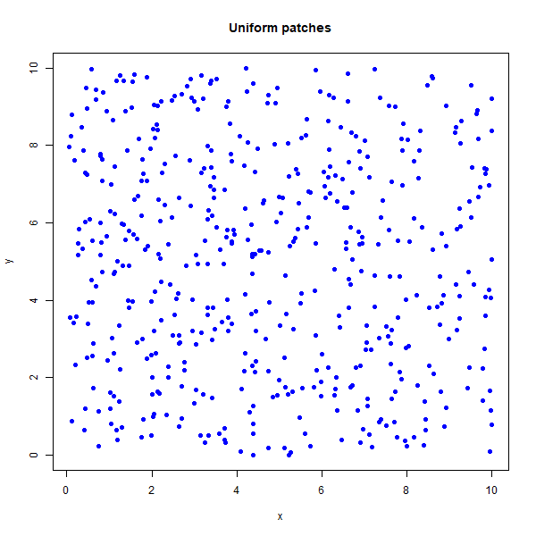
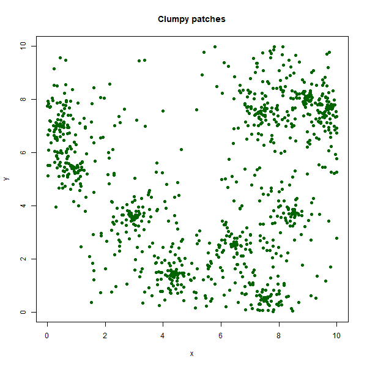
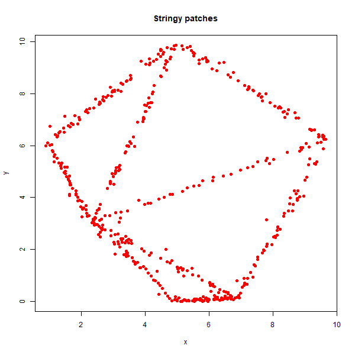
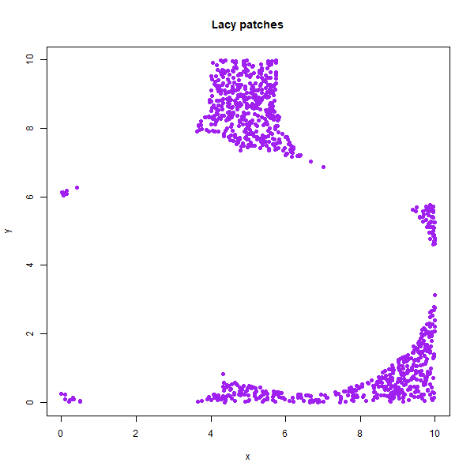

# syntheticnetworks
[](LICENSE.md)

**syntheticnetworks** is an R package for simulating synthetic spatial networks, particularly useful in ecological or spatial modelling contexts. It provides multiple algorithms for generating patch networks and calculating transition matrices. Transition rates are calculated from a distance based dispersal kernel (negative exponential). 

## Installation

```r
# From GitHub (if using devtools or remotes)
remotes::install_github("davidtmscott/synthetic-networks")
```

## Example 

```r
library(syntheticnetworks)

# Generate a clumpy patch landscape
patches <- generate_clumpy_patches(n.patches = 200, extent = 10, 
                                   clump_length = 1, n.foci = 5)

# Visualize
plot(patches$x, patches$y, main = "Clumpy Patches", pch = 19)

# Create transition matrix
tm <- calculate_transition_matrix(patches, dispersal = 2, R = 1)
```

## Example plots 

**Uniform patches**  


**Clumpy patches**  


**Stringy patches**  


**Lacy patches**  


## Features

- Simulate patch networks with different spatial structures:
  - `generate_uniform_patches()`: Evenly distributed patches across space.
  - `generate_clumpy_patches()`: Patches clustered into groups.
  - `generate_lacy_patches()`: Patches aligned along smoothed contours.
  - `generate_stringy_patches()`: Patches forming elongated or stringy shapes.
- Calculate a transition matrix using:
  - `calculate_transition_matrix()`: Based on Euclidean distances and a dispersal parameter.
- Outputs are standardized as named lists with `x` and `y` coordinates.

---

## License

This package is licensed under the [MIT License](LICENSE).

© 2025 David Scott

